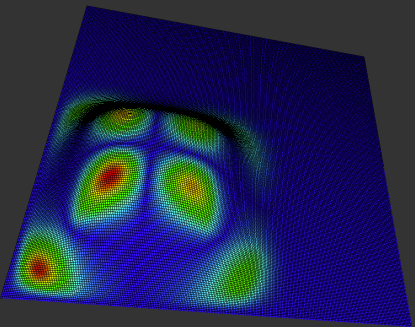
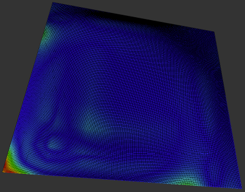
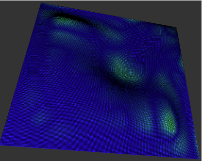
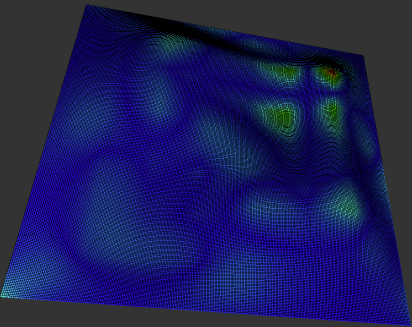

# *Dynamic-Based Modelling of Surface and Volumetric Objects*

## Project Aim
To develop a **prototype application** for the **real-time modelling of membranes and elastic solids**
under applied forces.

## Overview
This project implements a physics‑informed C++ simulation of dynamic B‑spline surfaces
and deformable solids, enabling parameter‑driven, time‑dependent analysis of structural response under applied forces.  

The dynamics of the membranes are formulated using **Lagrangian mechanics**, where the
equations of motion are expressed in terms of B-spline control points. This formulation
leads to a system of **partial differential equations (PDEs)**, which is solved numerically
using the **finite difference method (FDM)**. 
The solver is implemented in **C++**, built upon an existing numerical computation library.

## Key Features
- Dynamic B-spline surface modelling
- Lagrange-based formulation of membrane dynamics
- Numerical Partial Differential Equation solver via Finite Difference Method
- Parameter-driven simulation (density, damping, tension)
- Time-dependent membrane deformation
- C++ implementation with numerical libraries

## Technical Keywords
- B-Spline Curves & Surfaces  
- Lagrangian Dynamics  
- Partial Differential Equations (PDEs)  
- Finite Difference Method (FDM)  
- C++

## Results – Case Study
In this case study, the values of the membranes parameters are set as shown in the table below. The density and damping are low and the tension is high.

<table style="
  border-collapse: collapse;
  font-family: serif;
  font-size: 16px;
  line-height: 1.1;
">
  <thead>
    <tr>
      <th style="
        padding: 2px 10px;
        border-bottom: 2px solid black;
        border-right: 2px solid black;
        text-align: left;
      ">
        Parameters
      </th>
      <th style="
        padding: 2px 10px;
        border-bottom: 2px solid black;
        text-align: center;
      ">
        Values
      </th>
    </tr>
  </thead>

  <tbody>
    <tr>
      <td style="padding: 1px 10px; border-right: 2px solid black;">Order</td>
      <td style="padding: 1px 10px; text-align: center;">4</td>
    </tr>
    <tr>
      <td style="padding: 1px 10px; border-right: 2px solid black;">Membrane Length</td>
      <td style="padding: 1px 10px; text-align: center;">16</td>
    </tr>
    <tr>
      <td style="padding: 1px 10px; border-right: 2px solid black;">Number of segments</td>
      <td style="padding: 1px 10px; text-align: center;">7</td>
    </tr>
    <tr>
      <td style="padding: 1px 10px; border-right: 2px solid black;">Point Coordinates in u &amp; v</td>
      <td style="padding: 1px 10px; text-align: center;">3, 3</td>
    </tr>
    <tr>
      <td style="padding: 1px 10px; border-right: 2px solid black;">Density</td>
      <td style="padding: 1px 10px; text-align: center;">0.01</td>
    </tr>
    <tr>
      <td style="padding: 1px 10px; border-right: 2px solid black;">Damping</td>
      <td style="padding: 1px 10px; text-align: center;">0.02</td>
    </tr>
    <tr>
      <td style="padding: 1px 10px; border-right: 2px solid black;">Tension</td>
      <td style="padding: 1px 10px; text-align: center;">3625000.0</td>
    </tr>
    <tr>
      <td style="padding: 1px 10px; border-right: 2px solid black;">Execution Time (s)</td>
      <td style="padding: 1px 10px; text-align: center;">59</td>
    </tr>
  </tbody>
</table>

  <b>Table 5.1:</b> B-spline and Physical Parameters &amp; Values of the Membrane in Case Study 1

<table style="border-collapse:collapse; margin: 0 auto; font-family: serif; font-size: 18px;">
  <thead>
    <tr>
      <th style="padding:4px 16px; border-bottom:2px solid #000; border-right:2px solid #000;">
        Parameters
      </th>
      <th style="padding:4px 16px; border-bottom:2px solid #000;">
        Values
      </th>
    </tr>
  </thead>
  <tbody>
    <tr>
      <td style="padding:2px 16px; border-right:2px solid #000;">Order</td>
      <td style="padding:2px 16px;">4</td>
    </tr>
    <tr>
      <td style="padding:2px 16px; border-right:2px solid #000;">Membrane Length</td>
      <td style="padding:2px 16px;">16</td>
    </tr>
    <tr>
      <td style="padding:2px 16px; border-right:2px solid #000;">Number of segments</td>
      <td style="padding:2px 16px;">7</td>
    </tr>
    <tr>
      <td style="padding:2px 16px; border-right:2px solid #000;">Point Coordinates in u &amp; v</td>
      <td style="padding:2px 16px;">3, 3</td>
    </tr>
    <tr>
      <td style="padding:2px 16px; border-right:2px solid #000;">Density</td>
      <td style="padding:2px 16px;">0.01</td>
    </tr>
    <tr>
      <td style="padding:2px 16px; border-right:2px solid #000;">Damping</td>
      <td style="padding:2px 16px;">0.02</td>
    </tr>
    <tr>
      <td style="padding:2px 16px; border-right:2px solid #000;">Tension</td>
      <td style="padding:2px 16px;">3625000.0</td>
    </tr>
    <tr>
      <td style="padding:2px 16px; border-right:2px solid #000;">Execution Time in Seconds</td>
      <td style="padding:2px 16px;">59</td>
    </tr>
  </tbody>
</table>

<table>
<tr>
  <td align="center">
     
    <b>Membrane at Initial Condition</b> 
    This figure represents the membrane at the initial condition state, which also display the initial pluck condition of the surface.
  </td>
  <td align="center">
     
    <b>Membrane after 1 second</b> 
    The membrane the surface after 1 second, where the pluck in the surface is almost similar at the initial pluck of
    the surface, although the membrane has been set into motion and started absorbing the energies.
  </td>
  <td align="center">
     
    <b>Membrane after 5 seconds</b> 
    After 5 seconds, the state of the membrane changed significantly, where the
energy dissipate across the surface and the pluck pulled down the equilibrium axe of the
surface.
  </td>
</tr>

<tr>
  <td align="center">
     
    <b>Membrane after 10 seconds</b> 
    The membrane then slightly started to bounce up again to the right edge of the surface after 10 seconds has been elapsed.
  </td>
  <td align="center">
     
    <b>Membrane after 15 seconds</b> 
    We can note that the motion of the membrane bounced again to the top from the left edge of the membrane.
  </td>
  <td align="center">
     
    <b>Membrane after 20 seconds</b> 
    The membrane continued its motion toward the right edge, where it bounced slightly to the top in the middle of the surface.
  </td>
</tr>

<tr>
  <td align="center">
     
    <b>Membrane after 25 seconds</b> 
    This figure illustrates the state of the membrane at 25 seconds. At this stage, the motion has continued to propagate across the surface, showing a clear spread of the oscillatory pattern.
  </td>
  <td align="center">
     
    <b>Membrane after 30 seconds</b> 
    At 30 seconds. The motion not only persists but also shows a modest upward bounce as the wave approaches the right edge, indicating a slight reflection or change in amplitude near the boundary.
  </td>
  <td align="center">
     
    <b>Membrane after 35 seconds</b> 
    This figure shows that the pluck disappeared after 35 seconds, producing oscillation effects.
  </td>
</tr>

<tr>
  <td align="center">
     
    <b>Membrane after 40 seconds</b> 
    The oscillation effects started bouncing back again from the right edge.
  </td>
  <td align="center">
     
    <b>Membrane after 45 seconds</b> 
    After 45 seconds, the energies continued to be absorbed.
  </td>
  <td align="center">
     
    <b>Membrane after 50 seconds</b> 
    After 50 seconds, the surface shows a slight pluck at the right edge, whereas the left side and the middle of the surface is almost flat.
  </td>
</tr>

<tr>
  <td align="center">
     
    <b>Membrane after 55 seconds</b> 
    At 55 seconds, much of the energy within the system has been absorbed, and the overall motion has begun to diminish.
  </td>
  <td align="center">
     
    <b>Membrane after 59 seconds</b> 
    At 59 seconds, the remaining oscillations continue to weaken, indicating that the membrane’s motion is steadily mitigating as the system approaches a more settled state.
  </td>
</tr>
</table>

